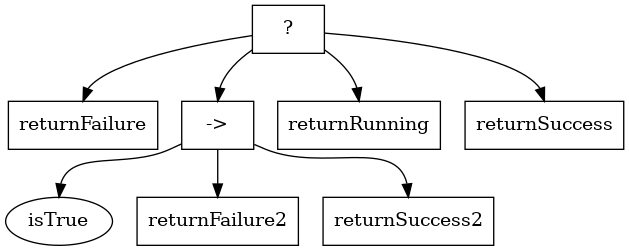
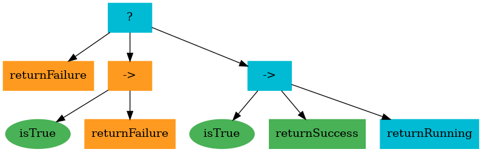

# BehaviorTree.jl

Behavior Trees (BTs) are a powerful way to describe the behavior of autonomous agents with applications in robotics and AI.

This implementation is based on [Behavior Trees in Robotics and AI: An Introduction](https://arxiv.org/abs/1709.00084).
It was developped by Team L3 to qualify in [NASA'Space Robotics Challenge Phase 2](https://spacecenter.org/22-teams-selected-for-final-stage-of-space-robotics-challenge-phase-2/) (More details on usage in this paper: [Human-Robot Teaming Strategy for Fast Teleoperation of a Lunar Resource Exploration Rover](https://www.researchgate.net/publication/344879839_Human-Robot_Teaming_Strategy_for_Fast_Teleoperation_of_a_Lunar_Resource_Exploration_Rover)).


# Installation
## Optional System Dependencies
Visualization tools depends on `graphviz`.  
On Ubuntu/Debian:
```bash
sudo apt-get install graphviz
```

## Install Julia Package
With Julia ≥ 1.4 (may work on previous 1.x version but not tested) add package
```julia
julia> ]
(v1.4) pkg> add BehaviorTree
```

## Basic Usage

Two Primitives are available to build behavior trees: `Sequence` and `Selector`. They accept a list of tasks, that can be a Sequence, a Selector, or, in the case of a leaf, a function returning one of `:success`, `:failure` or `:running`.

```julia
doSuccess(bb=Dict()) = :success
isTrue(bb=Dict()) = :success
doFailure(bb=Dict())= :failure
doRunning(bb=Dict()) = :running
bt = Selector([
    doFailure,
    Sequence([isTrue, doFailure, doSuccess], "choice"),
    doRunning,
    doSuccess!
], "head")
```
Execution of the tree happen via the `tick` function, that accepts a shared `blackboard` object use to share state between tasks.
```julia
blackboard = Dict{Symbol, Any}()
status, results = tick(bt, blackboard)
```
Ticking usually happens in a loop at at a frequency determined by the needs of the application.

## Visualization

As BehaviorTrees use the AbstractTree interface, it is possible to use [D3Trees](https://github.com/sisl/D3Trees.jl) for visualization:

```julia
d3tree = D3Tree(bt)
inbrowser(tree, "firefox")
```

Utilities to generate graphviz output via the `.dot` format are also provided.
```julia
dot_graph=toDot(bt)
filename= "example.dot"
open(filename, "w") do dot_file
    write(dot_file, dot_graph)
end
filename= "example.png"
png_graph = dot2png(dot_graph)
open(filename, "w") do png_file
    write(png_file, png_graph)
end
```


passing the execution results  in the toDot function generates a visualization of the current state:
```julia
dot_graph=toDot(bt, results)
filename= "status.png"
png_graph = dot2png(dot_graph)
open(filename, "w") do png_file
    write(png_file, png_graph)
end
```


